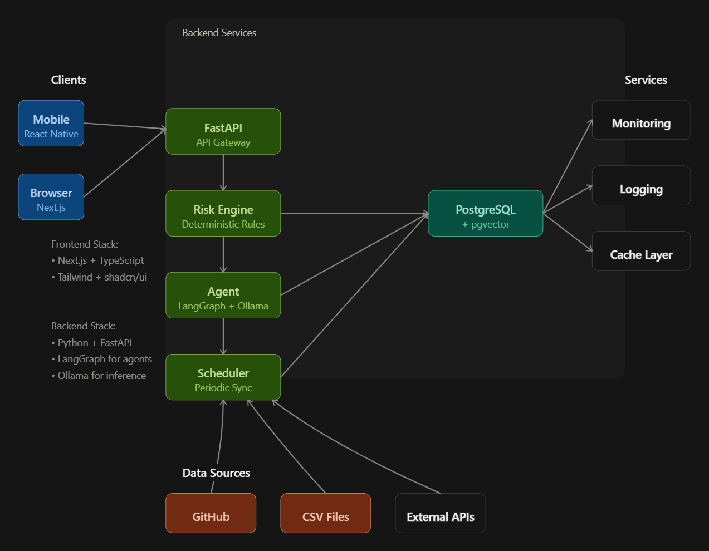

<div align="center">

<h1>RiskZen  </h1>

*AI-powered project risk early-warning and mitigation system.*



</div>


## Core Capabilities

- Detects risks across schedule, dependencies, scope, capacity, quality, budget, and decision latency.
- Shows the evidence behind each risk.
- Uses deterministic rules for detection.
- Uses a LangGraph agent for investigation and mitigation recommendations.
- Supports human approval, modification, dismissal, and snoozing of recommendations.
- Tracks actions, outcomes, data quality, and audit history.

## Stack

- <a href="https://nextjs.org/"> Next.js</a> • <a href="https://www.typescriptlang.org/"> TypeScript</a> • <a href="https://tailwindcss.com/"> Tailwind CSS</a> • <a href="https://ui.shadcn.com/"> shadcn/ui</a>

- <a href="https://www.python.org/"> Python</a> • <a href="https://fastapi.tiangolo.com/"> FastAPI</a>

- <a href="https://www.postgresql.org/"> PostgreSQL</a> • <a href="https://github.com/pgvector/pgvector"> pgvector</a>

- <a href="https://www.langchain.com/langgraph"> LangGraph</a>

- <a href="https://ollama.com/">Ollama</a>

- <a href="https://www.docker.com/"> Docker</a> • <a href="https://docs.docker.com/compose/"> Docker Compose</a>

## Quick Start

### Prerequisites

- [Docker](https://docs.docker.com/get-docker/)
- [Docker Compose](https://docs.docker.com/compose/install/)
- [Git](https://git-scm.com/)

### Installation

```bash
git clone https://github.com/ARUNAGIRINATHAN-K/riskzen-ai.git
cd riskzen-ai
```
```bash
cp .env.example .env
docker compose up -d
```


## Documentation

- [PRD](docs/PRD.md)
- [Architecture](docs/ARCHITECTURE.md)
- [Specification](docs/SPECIFICATION.md)
- [Implementation Plan](docs/IMPLEMENTATION-PLAN.md)
- [Implementation Blueprint](docs/IMPLEMENTATION-BLUEPRINT.md)
- [MVP](docs/MVP.md)
- [Changelog](CHANGELOG.md)

## Project Status

Pre-release. Documentation and planning are completed, implementation is started.

## Contributing

Read the [Contributing Guide](CONTRIBUTING.md) before submitting a pull request.

This project follows the [Contributor Covenant Code of Conduct](CODE_OF_CONDUCT.md).

## Security

Report security vulnerabilities according to [SECURITY.md](SECURITY.md).

Do not open a public issue for security vulnerabilities.

## License

This project is licensed under the [AGPL-3.0 License](LICENSE).